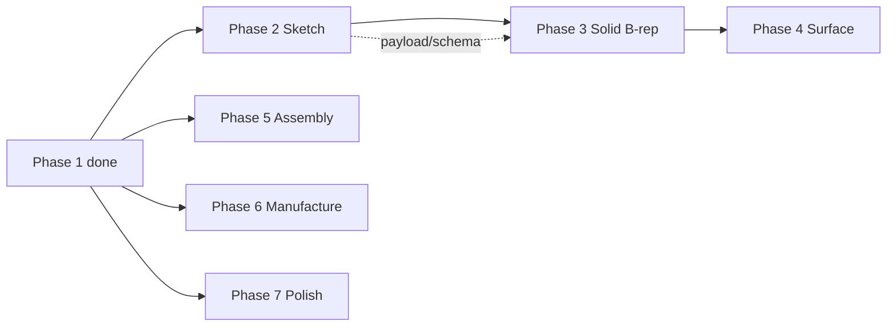

# Parallel agents: parity phases (how to run simultaneously)

You can run **multiple Cursor chats / engineers** at once **only if** they respect **stream boundaries** and **merge order**. Otherwise you will fight over the same files.

**Optional lead chat:** step-by-step coordinator workflow (pasteable choice, stream map, conflict matrix usage, merge order, gate matrix) → [`agents/COORDINATOR_PARALLEL_WORKFLOW.md`](agents/COORDINATOR_PARALLEL_WORKFLOW.md).

## Dependency waves

- **Wave A (safe parallel now):** Phase **5**, **6**, **7** — mostly disjoint from sketch/solid core.  
- **Wave B (one owner recommended):** Phase **2** — touches `design-schema`, solver, canvas, kernel payload.  
- **Phases 3–4 (kernel / loft):** coordinate with **Stream A** on `sketch-profile` / payload version — can advance in parallel only if you avoid conflicting schema edits (see [`PARITY_PHASES.md`](PARITY_PHASES.md) for current status).

## Stream ownership (do not cross without syncing)

| Stream | Primary paths | Avoid touching |
|--------|----------------|--------------|
| **A — Sketch (Phase 2)** | `src/shared/design-schema.ts`, `src/shared/sketch-profile.ts`, `src/renderer/design/*`, `src/renderer/design/solver2d.ts` | `engines/occt/build_part.py` except coordinated payload bumps; **`Viewport3D.tsx` / `viewport3d-bounds*`** when **Stream N** owns that batch (coordinate) |
| **N — Design 3D viewport** | `src/renderer/design/Viewport3D.tsx`, `viewport3d-bounds.ts`, `viewport3d-bounds.test.ts`, `.design-3d*` rules in `src/renderer/src/styles.css` | `Sketch2DCanvas`, `design-schema`, `sketch-profile`, `src/renderer/design/solver2d.ts`; global **`.viewport-3d`** / assembly viewport (**Stream C**); theme-wide **`styles.css`** (**Stream E**) — coordinate |
| **B — Solid kernel (Phase 3–4)** | `engines/occt/*`, `src/main/cad/build-kernel-part.ts`, `kernel-manifest-schema.ts` | Sketch UI until Stream A merges |
| **C — Assembly (Phase 5)** | `src/shared/assembly-schema.ts`, `src/renderer/assembly/*`, assembly IPC in `main/index.ts` | `design-schema.ts` |
| **D — Manufacture / CAM (Phase 6)** | `src/shared/manufacture-schema.ts`, `src/renderer/manufacture/*`, `src/main/cam-*`, `engines/cam/*` | Design sketch files |
| **E — Product / shell (Phase 7)** | `src/renderer/shell/*`, `src/renderer/commands/*`, `src/shared/fusion-style-command-catalog.ts`, `src/renderer/src/styles.css` | Prefer **new files** over huge `src/renderer/src/App.tsx` edits |

## Hot files (single writer or strict coordination)

- `src/renderer/src/App.tsx` + `src/renderer/shell/AppShell.tsx` (utilities tab strip / shell chrome) — **one agent** per PR for heavy churn, or split: only add **wrapper components** in new files and import them.  
- `src/preload/index.ts` + `src/main/index.ts` — extend IPC in **small, additive** handlers; merge conflicts if many agents add handlers at once → **serialize** or assign **[Stream S — IPC integration](agents/STREAM-S-ipc-integration.md)** (one owner per batch).  
- `src/shared/design-schema.ts` — **Stream A only** until Phase 2 lands.

## Recommended simultaneous setup (practical)

1. Open **4 Cursor chats** (or assign 4 people).  
2. Paste the matching brief from [`docs/agents/`](agents/README.md) into each chat.  
3. Run **at most one** of: Stream A **or** Stream B for kernel-heavy work — **not both** until schema stable.  
4. Prefer parallel: **C + D + E** while **A** works alone, **then** **B** after A.

## Merge order (when multiple PRs land)

1. Stream **A** (Phase 2) first if it changes `design-schema` / `sketch-profile`.  
2. Stream **B** (Phase 3) rebases on A.  
3. Streams **C, D, E** can merge in any order **if** they did not touch the same hot files; otherwise integrate branch order above.

## Status tracking

Update [`PARITY_PHASES.md`](PARITY_PHASES.md) when a stream completes; sync epic-level detail in [`PARITY_REMAINING_ROADMAP.md`](PARITY_REMAINING_ROADMAP.md) when backlog priorities or exit criteria change. Update command statuses in `fusion-style-command-catalog.ts` for user-visible honesty.

**Regression / QA:** kernel, CAM, and assembly mesh checklists → [`VERIFICATION.md`](VERIFICATION.md).

## Extra parallel lanes (pasteables)

Beyond A–E, you can run **Stream F (resources-only)** — [`agents/STREAM-F-resources-only.md`](agents/STREAM-F-resources-only.md) + **Aggressive — Stream F** — **Stream K (posts+machines-only)** — [`agents/STREAM-K-posts-machines.md`](agents/STREAM-K-posts-machines.md) + **Aggressive — Stream K** — **Stream L (slicer-only)** — [`agents/STREAM-L-cura-slicer.md`](agents/STREAM-L-cura-slicer.md) + **Aggressive — Stream L** — **Stream G (docs-only)** — [`agents/STREAM-G-docs-only.md`](agents/STREAM-G-docs-only.md) + **Aggressive — Stream G** — **Stream H (tests-only)** — [`agents/STREAM-H-tests-only.md`](agents/STREAM-H-tests-only.md) + **Aggressive — Stream H** — **Stream S (IPC: main + preload)** — [`agents/STREAM-S-ipc-integration.md`](agents/STREAM-S-ipc-integration.md) + **Aggressive — Stream S** — **Stream M (smoke + verification report)** — [`agents/STREAM-M-verifier-smoke.md`](agents/STREAM-M-verifier-smoke.md) + **Aggressive — Stream M** (`npm run typecheck`, in-chat **Gates / Drift / Handoffs**; **not** **`VERIFICATION_DRIFT.md`** — that stays **Stream T**) — **Stream N (design 3D viewport)** — [`agents/STREAM-N-design-viewport3d.md`](agents/STREAM-N-design-viewport3d.md) + **Aggressive — Stream N** (`Viewport3D`, `viewport3d-bounds*`, `.design-3d*` CSS; coordinate **A** / **C** per brief) — **Stream Q (Utilities UI)** — [`agents/STREAM-Q-utilities-ui.md`](agents/STREAM-Q-utilities-ui.md) + **Aggressive — Stream Q** — **Python engines:** **Stream I** (`engines/cam/`) — [`agents/STREAM-I-python-cam.md`](agents/STREAM-I-python-cam.md) + **Aggressive — Stream I** — and **Stream J** (`engines/occt/`) — [`agents/STREAM-J-python-occt.md`](agents/STREAM-J-python-occt.md) + **Aggressive — Stream J** — disjoint folders. Copy-paste blocks and a conflict matrix live in [`agents/PARALLEL_PASTABLES.md`](agents/PARALLEL_PASTABLES.md). For **merge-ready** parallel work, use the **Aggressive pastables** section there (forced `npm test`/`build`, **`Shipped:`** one-liner, **Stream S** IPC owner, **F/K/L/G/H/P/O/I/J/M/N/Q** bundled data vs docs vs tests vs main helpers vs shared schemas vs Python engines vs smoke report vs design viewport vs Utilities panels, **R** import/tools, **T** drift-file verifier).

**IPC drift:** adding a channel requires **both** `src/preload/index.ts` and `src/main/index.ts`. `npm test` runs `src/main/ipc-contract.test.ts` to catch missing handlers.
