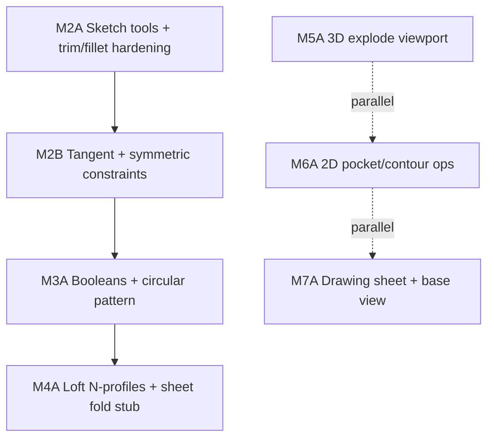

# Remaining parity roadmap (phases 2–7)

This document **expands** [`PARITY_PHASES.md`](PARITY_PHASES.md) into a **backlog**: epics, suggested order, **command catalog IDs** (`src/shared/fusion-style-command-catalog.ts`), key paths, and exit checks. It is **not** a promise of ship dates — commercial CAD parity is a **multi-year** surface area; use this to sequence work and parallelize streams safely ([`AGENT_PARALLEL_PLAN.md`](AGENT_PARALLEL_PLAN.md)).

**Rules of engagement**

1. Prefer **one command end-to-end** (schema → solver/kernel → UI → catalog status) over marking large areas “done” prematurely ([`FUSION_COMMAND_PARITY.md`](FUSION_COMMAND_PARITY.md)).
2. After geometry / CAM / assembly mesh changes: [`VERIFICATION.md`](VERIFICATION.md) + `npm test` from repo root (`unified-fab-studio/`).
3. Kernel / CadQuery: stay aligned with [`GEOMETRY_KERNEL.md`](GEOMETRY_KERNEL.md); bump payload / manifest schema only with tests and sample projects.

### Stretch — incremental deliveries (not “all stretch done”)

Commercial CAD–depth stretch work is still **mostly open**. **You cannot “finish all stretch” in one pass** — see [`STRETCH_SCOPE.md`](STRETCH_SCOPE.md). Shipped so far as **thin vertical slices**:

- **Assembly / shell:** interference report **download JSON**; **save** to `output/{assembly}-interference.json`; **`ut_interference`** opens **Assembly**; **hierarchical BOM** → `output/bom-hierarchical.txt` (`parentId` tree); **active tree JSON** → `output/bom-hierarchy.json`.
- **Drawings:** **`drawing/drawing.json`** + **Utilities → Project → Drawing manifest** (primary sheet name/scale + optional **view placeholders** with **per-slot editable labels**, fieldset + **`aria-live`** on slot changes); **`drawing:load` / `drawing:save`** IPC; PDF/DXF list placeholders in the title-block shell; palette **`dr_new_sheet`** / **`dr_base_view`** / **`dr_projected_view`** → Project tab.
- **Parameters:** **`design:exportParameters`** / **`design:mergeParameters`** (Utilities → Project) for `output/design-parameters.json` ↔ `design/sketch.json`.
- **Inspect (Design):** **`ut_measure`** / **`ut_section`** — 3D preview **Shift+click** distance (mm) on preview mesh; **Y** clipping plane slider (preview only; not kernel-accurate).
- **Kernel queue:** per-op **`suppressed`** on `kernelOps` → filtered in **`attachKernelPostOpsToPayload`** / **`activeKernelOpsForPython`** before `build_part.py`.
- **Manufacture:** **Simulation** — Manufacture tab **stub panel** (no stock-removal sim); catalog **`mf_simulate`** = **partial** with doc pointer.

---

## Phase 2 — Sketch depth

**Status:** **Baseline complete** — see current row in [`PARITY_PHASES.md`](PARITY_PHASES.md). The tables below mix **historical epics** with **remaining** work: many rows (e.g. extend/break/split, tangent, symmetric, concentric, radius/diameter) are already **implemented** — verify in [`fusion-style-command-catalog.ts`](../src/shared/fusion-style-command-catalog.ts) and [`STRETCH_SCOPE.md`](STRETCH_SCOPE.md).

**Goal:** Sketch workflows feel complete for **parametric 2D** that reliably feeds extrude / revolve / loft and kernel profile extraction (`sketch-profile.ts`).

### Shipped in baseline (reference)

Line tool, offset closed loops, trim, sketch fillet, tangent + symmetric constraints, linear dimension annotations (non-driving), prior constraint set + parameters UX — see phase table + `fusion-style-command-catalog.ts`.

**Spline / solver honesty:** `solver2d` applies only to **point IDs** in the map (and classic arc/circle entity constraints). `spline_fit` / `spline_cp` knot and control vertices are ordinary points; the interpolating / B-spline curve is derived in `sketch-profile` / mesh — there is **no** separate spline DOF energy. Catalog rows for `sk_spline_*` document this; `design-schema.test.ts` covers constraint round-trip on spline point ids.

### Epic 2.A — Sketch creation tools

| Priority | Catalog IDs | Deliverable |
|----------|-------------|-------------|
| High | `sk_line` | First-class **line** tool (or document polyline as the supported path and adjust catalog copy). |
| High | `sk_offset` | Offset loop / chain; preserve profile closure for extrude. |
| Medium | `sk_arc_center` (**shipped**), `sk_circle_2pt` (**shipped**), `sk_circle_3pt` (**shipped**), `sk_rect_3pt` (**shipped**) | Additional construction modes matching common CAD flows. |
| Medium | `sk_slot_center` / `sk_slot_overall` (**shipped** — same `slot` entity; center–center vs overall tip length), `sk_polygon` (**regular N-gon → closed polyline, shipped**), `sk_ellipse` (**shipped** — native entity + tessellation) | Primitives as constrained polyline/circle arcs or native entities in `design-schema`. |
| Medium | `sk_spline_fit`, `sk_spline_cp` (**shipped** — B-spline display; solver still point/knot–based; see stretch honesty) | Splines: schema, solver interaction (often phased: display-only → constrained). |

### Epic 2.B — Sketch modify

| Priority | Catalog IDs | Deliverable |
|----------|-------------|-------------|
| High | `sk_trim` → **implemented** | Close gaps called out in phase 2 notes (mixed entities, edge cases). |
| High | `sk_fillet_sk` → **implemented** | Arc–arc / non-polyline corners if required for parity; constraint behavior on filleted corners. |
| Medium | `sk_extend`, `sk_break`, `sk_split` | Classic modify stack. |
| Medium | `sk_chamfer_sk` → **implemented** | Chamfer corners (point-ID polyline, leg length L). |
| Low | `sk_mirror_sk`, `sk_move_sk`, `sk_rotate_sk`, `sk_scale_sk` (**shipped** — whole sketch or **selection-scoped** when sketch points are selected) | Optional ribbon / constraint coupling polish. |
| Low | `sk_pattern_sk` (**shipped** — linear + **circular** whole-sketch pattern; circular step = total°÷count like kernel `pattern_circular`) | **Path** sketch pattern along polyline; richer pattern UX. |
| Low | `sk_project` (**partial** — mesh click → plane projection → open polyline; not true edge topology) | Full edge/curve trim + body refs — **Stream N** + kernel honesty. |

### Epic 2.C — Constraints

| Priority | Catalog IDs | Deliverable |
|----------|-------------|-------------|
| High | `co_tangent` | Line–arc / arc–arc tangent; extends `solver2d.ts` + schema. |
| Medium | `co_concentric`, `co_symmetric` | Common mechanical sketch constraints. |
| Medium | `co_radius`, `co_diameter` | Tie circle/arc radii to parameters. |
| Low | `co_smooth`, `co_polygon` | G2 / polygon edge equality bundles. |

### Epic 2.D — Dimensions (on-screen)

| Priority | Catalog IDs | Deliverable |
|----------|-------------|-------------|
| Medium | `dim_linear`, `dim_aligned`, `dim_angular`, `dim_radial`, `dim_diameter` | **Annotation** layer (may be non-driving initially); long-term: link to parameters / constraints. |

### Phase 2 exit criteria

- [ ] Closed profiles used by extrude/revolve/loft remain consistent between **Three preview** and **`extractKernelProfiles`** / kernel build.
- [ ] New sketch entities have **Zod** coverage in `design-schema` and tests where geometry is fragile (`sketch-profile.test.ts`, `solver2d.test.ts`).
- [ ] **Utilities → Commands** statuses updated for every finished catalog row.

**Primary paths:** `src/shared/design-schema.ts`, `src/shared/sketch-profile.ts`, `src/renderer/design/solver2d.ts`, `src/renderer/design/*` sketch UI.

---

## Phase 3 — Solid modeling on B-rep (kernel)

**Goal:** Post-extrude **feature history** in `part/features.json` / `kernelOps` matches more of what users expect from parametric solids, with clear failure messages from `build_part.py`.

### Baseline

[`GEOMETRY_KERNEL.md`](GEOMETRY_KERNEL.md): `fillet_all`, `chamfer_all`, `shell_inward`, `pattern_rectangular`, `pattern_circular`, `pattern_linear_3d`, cylinder/box union/subtract/**intersect**, `mirror_union_plane`, payload **v3**, samples `resources/sample-kernel-solid-ops/`, Design **kernel op queue** (reorder/remove).

### Epic 3.A — Combine / boolean depth

| Priority | Catalog IDs | Deliverable |
|----------|-------------|-------------|
| High | `so_combine` | **Partial:** profile-driven combine via `boolean_combine_profile` (union/subtract/intersect from `profileIndex` + depth/zStart) plus prior primitive booleans; **`profileIndex`** is range-checked against payload **`profiles`** in `build_part.py` pre-OCC; richer body references + diagnostics still planned. |
| Medium | `so_split`, `so_hole` | **Partial:** `split_keep_halfspace` (axis + **`offsetMm`** + **`keep`** positive/negative; extra sample with negative keep + offset) and `hole_from_profile` (depth requires **`depthMm`** in JSON; through-all). Full split-body management and hole wizard semantics remain planned. |
| Low | `so_thread` | **Partial:** `thread_cosmetic` ring-groove approximation; **≤256** ring cuts per op in kernel; true helical/standards workflow still planned. |

### Epic 3.B — Patterns & mirrors

| Priority | Catalog IDs | Deliverable |
|----------|-------------|-------------|
| High | `so_pattern_circ` | **Shipped:** `pattern_circular` in `kernelOps` / `build_part.py` (+Z pivot); Design ribbon **+ circ pattern**; sample [`features.circular.example.json`](../resources/sample-kernel-solid-ops/part/features.circular.example.json). |
| High | *(linear 3D)* | **Shipped:** `pattern_linear_3d` + sample [`features.linear3d.example.json`](../resources/sample-kernel-solid-ops/part/features.linear3d.example.json). |
| Medium | `so_pattern_path` | **Partial:** `pattern_path` with path-point sampling along sketch polyline (translation-only); optional **`closedPath`** includes the closing edge in arc-length sampling. |
| Medium | `so_mirror_body` | **Partial:** `mirror_union_plane` (YZ/XZ/XY + origin) + sample [`features.mirror.example.json`](../resources/sample-kernel-solid-ops/part/features.mirror.example.json). |

### Epic 3.C — Modify & create extensions

| Priority | Catalog IDs | Deliverable |
|----------|-------------|-------------|
| Medium | `so_fillet`, `so_chamfer` | **Partial:** directional edge selection (`fillet_select` / `chamfer_select`, ±X/±Y/±Z) in addition to all-edge ops; full graph/face selection still planned. |
| Medium | `so_shell` | **Partial:** one cap per op via **`openDirection`** ±X/±Y/±Z (default +Z) + opposite-cap fallback; multiple open faces / thickness variants per op if CadQuery allows. |
| Low | `so_sweep`, `so_pipe`, `so_thicken` | **Partial:** `sweep_profile_path` / `pipe_path` / `thicken_scale` surrogates are implemented; orientation-follow and true offset/surface behavior still planned. |
| Low | `so_rib`, `so_web` | Still planned as separate kernel + UI projects. |
| Low | `so_coil` | **Partial:** kernel **`coil_cut`** (stacked ring-cut surrogate, **≤1024** ring instances) + sample [`features.coil-cut.example.json`](../resources/sample-kernel-solid-ops/part/features.coil-cut.example.json); true coil/sweep UX still planned. |
| Medium | `so_move_copy`, `so_press_pull` | **Partial:** `transform_translate` (move/copy union) and `press_pull_profile` (signed profile delta). Direct-manipulation UX remains planned. |

### Epic 3.D — Feature browser ↔ kernel

- **Partial:** Design ribbon lists **ordered** `kernelOps` with **remove**, **move up/down**, and **Supp.** (per-op **`suppressed`** — omitted from CadQuery `postSolidOps`, order preserved in `part/features.json`). Stretch: safer reorder hints, selective edge fillet in kernel.

### Phase 3 exit criteria

- [x] Every **shipped** `kernelOps` kind in this phase: schema in `part-features-schema`, **`build_part.py`** branch, and **example JSON** under `resources/sample-kernel-solid-ops/part/` (see README index; profile-based ops pair with `design/sketch.rect-circle.example.json`).
- [x] `npm test` extends coverage for schema + `kernelPayloadVersionForOps` / `kernelOpSummary` where applicable, and **`sample-kernel-solid-ops-examples.test.ts`** parses all `part/*.example.json`.
- [x] `payloadVersion` **v3** rules documented in `GEOMETRY_KERNEL.md`.

**Primary paths:** `engines/occt/build_part.py`, `src/main/cad/build-kernel-part.ts`, `src/shared/part-features-schema.ts`, `src/shared/kernel-manifest-schema.ts`, Design solid UI.

---

## Phase 4 — Surfaces, sheet metal, plastic

**Goal:** Move from **stubs** to usable **loft/surface/sheet** workflows where preview and STEP agree.

### Baseline (**shipped**)

- **Loft:** 2–16 profiles, uniform `loftSeparationMm`, preview + kernel ([`GEOMETRY_KERNEL.md`](GEOMETRY_KERNEL.md) §Phase 4); sample [`resources/sample-kernel-loft-multi/`](../resources/sample-kernel-loft-multi/README.md).
- **`loftStrategy`** on manifest for loft builds (two-profile tags unchanged; multi-profile `multi+union-chain:…`).
- **`sheet_tab_union`** + ribbon **+ sheet tab**; sample [`resources/sample-kernel-sheet-tab/`](../resources/sample-kernel-sheet-tab/README.md).

### Epic 4.A — Loft / surfaces

| Priority | Catalog IDs | Deliverable |
|----------|-------------|-------------|
| High | `so_loft`, `su_loft` | **Shipped:** multi-profile loft (cap 16), documented preview/kernel parity (union-chain vs single multi-wire OCC). |
| Medium | `su_extrude`, `su_revolve`, `su_sweep`, `su_patch` | Surface bodies in kernel + preview strategy (may stay partial long-term). |
| Low | `su_trim`, `su_extend`, `su_stitch`, `su_thicken` | Surface tools — typically **after** stable surface creation. |
| Medium | *(guides)* | Loft rails / guide curves — **planned**. |

### Epic 4.B — Sheet metal

| Priority | Catalog IDs | Deliverable |
|----------|-------------|-------------|
| High | `sm_fold` | Bend representation: k-factor, bend lines → kernel — **planned**. |
| High | `sm_flat_pattern` | Flat pattern export / DXF-SVG — **planned**. |
| Medium | `sm_flange` | **Partial:** axis-aligned **`sheet_tab_union`** + UI; flange **with bend metadata** — **planned**. |

### Epic 4.C — Plastic design

| Priority | Catalog IDs | Deliverable |
|----------|-------------|-------------|
| Low | `pl_rule_fillet`, `pl_boss`, `pl_lip_groove` | Rule-based features once solid history is richer — **planned**. |

### Phase 4 exit criteria

- [x] Loft + sheet tab: **preview + kernel** agreement and limits documented in [`GEOMETRY_KERNEL.md`](GEOMETRY_KERNEL.md) (multi-loft uses segment union-chain).
- [x] Manifest records **`loftStrategy`** when the Python build chooses a strategy (incl. multi-section tag).

**Primary paths:** `build_part.py`, `sketch-mesh.ts` (`buildLoftedGeometry`), `sketch-profile.ts` (`buildKernelBuildPayload`, `LOFT_MAX_PROFILES`), Design ribbon, `part/features.json` / `design-schema`.

---

## Phase 5 — Assembly

**Goal:** Assembly workspace approaches **joint-driven** layout with optional **motion** and **explode**, while keeping mesh-based interference trustworthy.

### Baseline (**shipped**)

v2 `assembly.json`, joints through **`ball`**, BOM/summary/export, interference with STL `meshPath`, **3D assembly viewport** (STL preview + explode slider + keyframe motion scrub/play), IPC **`assembly:readStlBase64`**.

### Epic 5.A — Joints & references

| Priority | Catalog IDs | Deliverable |
|----------|-------------|-------------|
| Medium | `as_insert`, `as_joint_*` | Joint presets + **DOF hint copy**; **Duplicate row** + **Insert from project…** (relative `partPath`) — **partial** (not a solver). |
| Medium | `as_motion_link` | **`linkedInstanceId` + `motionLinkKind`** + inline incomplete-field hints — **partial** (stub). |

### Epic 5.B — Explode & motion (3D)

| Priority | Catalog IDs | Deliverable |
|----------|-------------|-------------|
| High | `as_explode_motion_meta` | **Shipped:** viewport explode along `explodeView.axis` with row-index × `stepMm` × preview factor; motion from `keyframesJson` (`t` + `rzDeg`/`deg`, ≥2) — **preview-only**, no joint limits. |
| Medium | *(solver)* | **Partial:** **revolute** + **slider** + **universal** (two-angle) + **cylindrical** (slide + spin) preview fields on **parentId** subtrees (viewport-only; not a solver). Motion study keyframes compose **after** joint previews (+Y assembly rotation). True kinematics / joint limits — **planned**. |

### Epic 5.C — Interference & BOM depth

| Priority | Catalog IDs | Deliverable |
|----------|-------------|-------------|
| Medium | `as_interference` | **Partial:** download JSON and/or **save** `output/{assembly}-interference.json` after a check. |
| Low | `as_bom`, `as_summary` | Flat **CSV** + **tree** `bom-hierarchical.txt`; optional **`bomUnit` / `bomVendor` / `bomCostEach`** — **partial**; Assembly BOM **preview** **Thumb** column (STL raster + cache + lazy-load) — **partial** (not exported to CSV). |

### Phase 5 exit criteria

- [x] Viewport + explode/motion are **preview-only**; **mesh interference** path unchanged (`assembly-mesh-interference.test.ts`).
- [x] Schema backward compatible; **`meshPath`** lint unchanged.

**Primary paths:** `assembly-schema.ts`, `assembly-viewport-math.ts`, `assembly-mesh-interference.ts`, `AssemblyViewport3D.tsx`, `AssemblyWorkspace.tsx`, `index.ts` IPC.

**Research note (not shipped):** scope for a future kinematics tier vs preview stubs — [`ASSEMBLY_KINEMATICS_RESEARCH.md`](ASSEMBLY_KINEMATICS_RESEARCH.md).

---

## Phase 6 — Manufacture (CAM) & simulation

**Status:** **Baseline complete** — see the phase row in [`PARITY_PHASES.md`](PARITY_PHASES.md). Epics below are **stretch** (2D cycles, simulation, etc.), not blockers for Phase 7.

**Goal:** **Reliable** op kinds, posts, and UI copy that never imply **safe** G-code without user verification ([`MACHINES.md`](MACHINES.md)).

### Baseline (**shipped**)

Setups, stock, **`fixtureNote`**, WCS **G54–G59** in post; op kinds **`cnc_parallel`** (built-in parallel finish), **`cnc_waterline`** / **`cnc_adaptive`** / **`cnc_raster`** with **OpenCAMLib** in [`engines/cam/ocl_toolpath.py`](../engines/cam/ocl_toolpath.py) when **`opencamlib`** is installed, else **`cam-local`** / mesh fallbacks + **IPC hints** (`describeCamOperationKind`); **`cnc_contour`** / **`cnc_pocket`** / **`cnc_drill`** run built-in 2D paths from operation geometry (`contourPoints` / `drillPoints`) with hard validation (missing/invalid geometry is an error, no STL fallback).

### Epic 6.A — 2D milling

| Priority | Catalog IDs | Deliverable |
|----------|-------------|-------------|
| High | `mf_op_2d_face`, `mf_op_2d_pocket` | **Baseline shipped:** 2D contour/pocket from `contourPoints` geometry. **Stretch:** geometry authoring UX from sketches/projected edges, richer entry/path options, and finish-quality controls. |
| Medium | `mf_op_2d_drill` | **Baseline shipped:** drill from `drillPoints` with machine-aware cycle behavior (Grbl expanded fallback, others default G81, optional G83 via params). **Stretch:** fuller per-controller cycle depth and peck/retract tuning UX. |

### Epic 6.B — 3D finishing / roughing

| Priority | Catalog IDs | Deliverable |
|----------|-------------|-------------|
| High | `mf_op_waterline`, `mf_op_adaptive`, `mf_op_raster`, `mf_op_parallel` | Harden OCL paths; improve hints when falling back; document limits. |
| Medium | `mf_op_contour`, `mf_op_pocket_3d` | Consistent parameter mapping via `cam-cut-params.ts`. |
| Low | `mf_op_pencil` | Rest machining — after adaptive is stable. |

### Epic 6.C — Additive & turning

| Priority | Catalog IDs | Deliverable |
|----------|-------------|-------------|
| Medium | `mf_additive` | Deeper Cura/slicer integration, presets. |
| Low | `mf_turning` | Separate post + op taxonomy — large scope. |

### Epic 6.D — Simulation

| Priority | Catalog IDs | Deliverable |
|----------|-------------|-------------|
| Low | `mf_simulate` | **Partial:** Manufacture tab **stub** + docs (`STRETCH_SCOPE.md`); stock removal visualization or external hook — **optional / future**. |

### Phase 6 exit criteria

- [x] **Shipped** op kinds: `manufacture-schema`, `cam-runner` / `cam-local` / `ocl_toolpath.py`, and tests (`src/main/cam-*.test.ts`, `cam-operation-policy.test.ts`, `manufacture-schema.test.ts`, shared `cam-cut-params` where applicable).
- [x] UI + IPC strings reference **unverified** output and OCL vs fallback behavior ([`ManufactureWorkspace.tsx`](../src/renderer/manufacture/ManufactureWorkspace.tsx), `describeCamOperationKind`).
- [x] `cnc_contour` / `cnc_pocket` / `cnc_drill` require valid 2D operation geometry (`contourPoints` / `drillPoints`) and fail fast on missing/invalid geometry (no STL parallel fallback).
- [x] **`resources/posts/cnc_generic_mm.hbs`** and CNC machine JSON match current emitted moves (G54–G59, feeds/retracts); deeper controller-specific canned-cycle coverage remains **stretch** under Epic 6.A.

**Primary paths:** `src/shared/manufacture-schema.ts`, `src/main/cam-runner.ts`, `src/main/cam-local.ts`, `engines/cam/*`, `src/renderer/manufacture/*`.

---

## Phase 7 — Product polish (shell, drawings, inspect)

**Status:** **Baseline complete** — see the phase row in [`PARITY_PHASES.md`](PARITY_PHASES.md). Epics below are **stretch** (real drawing pipeline, inspect tools), not blockers for post–phase-7 maintenance.

**Goal:** **Discoverability**, documentation export, and inspect/manage tools that match catalog promises.

### Baseline (**shipped**)

Command palette (catalog search, a11y, workspace filter), keyboard shortcuts reference + global chords, status footer + discoverability hint, drawing **PDF/DXF** export **without** projected model views, **partial** parameters UX + palette integration, project open/save/import/export, persisted **last workspace** and resizable panel columns, Browser/Properties polish.

### Epic 7.A — Drawings

| Priority | Catalog IDs | Deliverable |
|----------|-------------|-------------|
| High | `dr_new_sheet`, `dr_base_view`, `dr_projected_view` | **Partial:** **`drawing/drawing.json`** + Utilities → Project **Drawing manifest** (primary sheet name/scale); exports consume first sheet in PDF/DXF header. **Base/projected views** — **planned**. |
| Medium | `dr_export_pdf`, `dr_export_dxf` | **Partial:** title block + optional manifest metadata (see above). |

### Epic 7.B — Inspect & manage

| Priority | Catalog IDs | Deliverable |
|----------|-------------|-------------|
| Medium | `ut_measure`, `ut_section` | **Partial:** Design **3D preview** — measure (**Shift+click** two points, mm) + section (**Y** clip); preview mesh / Three.js only. |
| Low | `ut_interference` | **Partial:** palette → **Assembly** workspace + status hint (same intent as `as_interference`). |
| Low | `ut_material`, `ut_appearance` | Appearance presets; material metadata for BOM/export. |

### Epic 7.C — Power user / automation

| Priority | Catalog IDs | Deliverable |
|----------|-------------|-------------|
| Low | `ut_derive`, `ut_scripts` | Derived components / script hooks — scope carefully for security in Electron. |

### Epic 7.D — Parameters & config

| Priority | Catalog IDs | Deliverable |
|----------|-------------|-------------|
| Medium | `ut_parameters` → **implemented** | Full CRUD, units, export/import with design files. |

### Epic 7.E — Unified 3D mesh import

| Priority | Catalog IDs | Deliverable |
|----------|-------------|-------------|
| High | `ut_import_3d`, `ut_import_stl`, `ut_import_step` | **Shipped:** `assets:importMesh` + registry (`mesh-import-registry.ts`); STL copy; STEP → STL (CadQuery); mesh formats → STL (`engines/mesh/mesh_to_stl.py`, **trimesh**); `importHistory` on project; Utilities **Import 3D model…** with **`dialog:openFiles`** multi-select; collision-safe names in `assets/` (`unique-asset-filename.ts`). Legacy `cad:importStl` / `cad:importStep` delegate to the same registry. |
| Medium | — | **Phase 2 (shipped):** **Batch mesh import**; **Fusion Manufacture CSV** tool paste (`fusion_csv`); **tool library file** import (`tools:importFile` + **Import library file…**) for CSV/JSON and **best-effort HSM-style XML** (`.hsmlib`, `.tpgz`, `.tp.xml`, gzipped `Tool` blocks, `parseHsmToolLibraryXml`). |
| Low | — | **Stretch:** CAM **post** sources (e.g. `.cps`) as managed project assets or validated posts; fuller **`.hsmlib`** schema coverage; richer CAD round-trip where licensing allows. |

### Phase 7 exit criteria

- [x] **IPC:** drawing export and other utilities that use **`invoke`** stay registered in **preload + main**; **`ipc-contract.test.ts`** passes when channels change.
- [x] **Shortcuts:** chord behavior covered in **`app-keyboard-shortcuts.test.ts`**; human-readable table in [`KEYBOARD_SHORTCUTS.md`](KEYBOARD_SHORTCUTS.md) stays aligned with [`app-keyboard-shortcuts.ts`](../src/shared/app-keyboard-shortcuts.ts) (update **TS first**).
- [x] **Drawing export:** PDF/DXF paths exercised by **`drawing-export-*.test.ts`**; catalog **`dr_export_*`** notes “no model views yet” until Epic 7.A.

**Primary paths:** `src/renderer/shell/*`, `src/renderer/commands/*`, drawing export services in `src/main/`, `fusion-style-command-catalog.ts`.

---

## Suggested sequencing (milestones)

These **milestones** respect dependencies in [`AGENT_PARALLEL_PLAN.md`](AGENT_PARALLEL_PLAN.md): Phase **2** before heavy **3–4** schema coupling; **5–7** can advance in parallel with clear file ownership.

| Milestone | Phases | Focus |
|-----------|--------|--------|
| **M2A–M2B** | 2 | Sketch completeness + solver stability |
| **M3A** | 3 | Kernel ops users ask for daily (combine, patterns) |
| **M4A** | 4 | Loft/sheet progression |
| **M5A** | 5 | Explode + motion playback |
| **M6A** | 6 | Shop-floor 2D + hardened 3D |
| **M7A** | 7 | Real drawing pipeline |

---

## Appendix — stream ownership (reminder)

| Stream | Phase focus | Hot paths |
|--------|-------------|-----------|
| A | 2 | `design-schema`, `sketch-profile`, `solver2d`, sketch renderer |
| B | 3–4 | `build_part.py`, `build-kernel-part.ts`, feature schema |
| C | 5 | `assembly-schema`, assembly renderer, assembly IPC |
| D | 6 | `manufacture-schema`, CAM main + engines |
| E | 7 | shell, commands palette, drawing export |
| O | cross-cutting | `src/shared/**` except `design-schema` / `sketch-profile` (Zod, pure helpers — parallel with C/D/E when files disjoint) |

When this roadmap changes, update the **summary row** in [`PARITY_PHASES.md`](PARITY_PHASES.md) if the **phase theme** or **done/next** narrative shifts materially. **Auxiliary lane index:** [`docs/agents/README.md`](agents/README.md), [`docs/agents/PARALLEL_PASTABLES.md`](agents/PARALLEL_PASTABLES.md).
