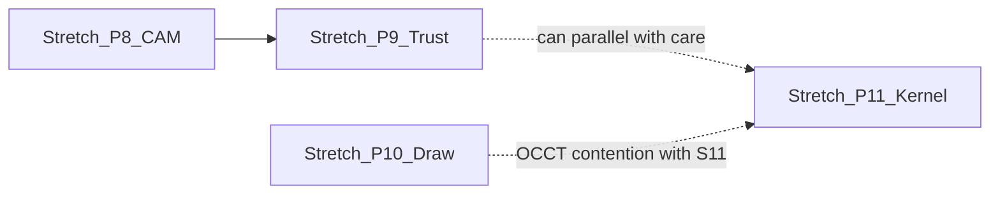

# Stretch plan — Phases 8–11 (after program + full-fat slices)

**Purpose:** [`PARITY_PHASES.md`](PARITY_PHASES.md) marks Phases **8–11** as **done** for shipped slices (program +, where noted, full-fat batch). This document is the **remaining stretch** backlog: large milestones only, explicit **non-goals**, stream ownership, and exit criteria. It does **not** replace the historical full-fat breakdown in your local planning notes; it **sequences** what is still open.

**References:** [`PARITY_REMAINING_ROADMAP.md`](PARITY_REMAINING_ROADMAP.md) (Phase 8–11 epics + Phase 3 kernel depth), [`VERIFICATION.md`](VERIFICATION.md), [`AGENT_PARALLEL_PLAN.md`](AGENT_PARALLEL_PLAN.md), [`MACHINES.md`](MACHINES.md).

**Non-goals (all stretch work):** Collision-safe industrial simulation, certified “safe G-code,” or full Fusion CAD/CAM/drawing parity. All CAM and drawing output stays **operator-verified**.

**Parallelism:** Phase **8** and **9** mostly **Stream P** + **Stream I** (`engines/cam/`). Phase **10** projection and Phase **11** kernel both touch **`engines/occt/`** (**Stream J**) — avoid two heavy Python tracks in the same merge batch unless files are disjoint.

---

## Phase 8 stretch — CAM depth (what is still open)

**Baseline already shipped:** Scallop stepover, scalar `rasterRestStockMm`, stock-driven `safeZMm` / auto raster rest, `cam:run` stock box, 4-axis **X** clamp from STL + **axial bands** / auto `zStepMm`, guardrails/catalog/docs updates.

| Milestone | Big deliverable | Primary paths |
|-----------|-----------------|---------------|
| **8.S1 — Rest roughing MVP** | **Previous-op-aware** or **height-field delta** rest (coarse grid or bbox), not only a scalar offset: pencil/raster “clear what’s left” intent. Optional OCL knobs. | `src/main/cam-local.ts`, `src/shared/cam-heightfield-2d5.ts`, `engines/cam/ocl_toolpath.py`, `src/main/cam-runner.ts` |
| **8.S2 — Geometry-informed 4-axis** | Move beyond cylinder + bands: e.g. **Z height bands from mesh**, **silhouette slices**, or **indexed normals** feeding `axis4_toolpath.py`; extend `cam:run` JSON contract. Keep posts **unverified** ([`resources/posts/cnc_4axis_grbl.hbs`](../resources/posts/cnc_4axis_grbl.hbs)). | `engines/cam/axis4_toolpath.py`, `src/main/cam-runner.ts` |
| **8.S3 — Depth-of-cut defaults** | Optional **DOC** from **stock Z vs STL bounds** when both exist (Manufacture + Shop), without overriding explicit op params. | `src/shared/cam-cut-params.ts`, `src/shared/manufacture-schema.ts`, `ManufactureWorkspace.tsx`, `ShopApp.tsx` |

**Exit criteria:** New automated tests (rest model and/or axis4 segments and/or DOC resolution); [`VERIFICATION.md`](VERIFICATION.md) CAM rows; `npm test` + `npm run build` + `npm run typecheck`; no regression on `cam-runner.test.ts` / `cam-local.test.ts`.

---

## Phase 9 stretch — Trust layer (what is still open)

**Baseline already shipped:** Voxel stock **Z** + **XY** extent, approximate tier copy, `workAreaMm` + large-**A** hints, shared feed/plunge floors vs guardrails + `calcCutParams`, sim panel rotary disclaimer.

| Milestone | Big deliverable | Primary paths |
|-----------|-----------------|---------------|
| **9.S1 — Simulation performance / fidelity** | Faster Tier 2–3 coarse removal; tunable budgets; honest UI tiering (still **not** boolean-exact). | `src/shared/cam-voxel-removal-proxy.ts`, `ManufactureCamSimulationPanel.tsx`, optional `cam-heightfield-2d5.ts` |
| **9.S2 — Envelope + rotary depth** | **Radial** / rotary soft limits beyond box 0…`workAreaMm` where data exists; optional **pre-post** warnings in policy copy. | `src/shared/cam-machine-envelope.ts`, `src/main/cam-operation-policy.ts`, `src/main/cam-runner.ts` |
| **9.S3 — Tool × material matrix** | **Chipload / surface speed** tables by material category + tool type; surface **recommended vs clamped** in Shop/Manufacture; keep one source of truth with guardrails (`cam-numeric-floors` / shared constants). | `src/shared/material-schema.ts`, Shop apply-material, `cam-toolpath-guardrails.ts` |

**Exit criteria:** At least one new test per major warning or sim behavior change; [`VERIFICATION.md`](VERIFICATION.md) updated; explicit UI strings remain **approximate / not collision-safe**.

---

## Phase 10 stretch — Drawings + job documentation (what is still open)

**Baseline already shipped:** Tier A mesh edges + optional **convex hull** merge; Shop + **Manufacture** setup sheet HTML; drawing manifest (scale, placeholders, layout).

| Milestone | Big deliverable | Primary paths |
|-----------|-----------------|---------------|
| **10.S1 — Projection upgrade (pick one track per batch)** | **(A)** OCCT **section or silhouette** (or stronger projection) in [`engines/occt/project_views.py`](../engines/occt/project_views.py) + TS bridge; **or (B)** documented **HLR research spike** + fallback. Must not break [`src/main/drawing-export-service.test.ts`](../src/main/drawing-export-service.test.ts) / golden PDF–DXF expectations. | `project_views.py`, `src/main/drawing-export-service.ts`, `drawing-project-model-views.ts` |
| **10.S2 — Richer job packet** | Setup sheet: **post-guardrail** resolved numbers, **tool list** with stickout/notes, **G-code excerpt** and/or **operation order** table from real manufacture state. | `src/renderer/src/setup-sheet.ts`, Manufacture + Shop flows |
| **10.S3 — Drawing manifest / templates** | Optional **sheet template** hints aligned with [`src/shared/drawing-sheet-schema.ts`](../src/shared/drawing-sheet-schema.ts); polish scale + placeholder UX only if schema ownership is clear (**Stream Q** / **O**). | `drawing-sheet-schema.ts`, `DrawingManifestPanel.tsx` |

**Exit criteria:** Drawing export tests pass; [`VERIFICATION.md`](VERIFICATION.md) golden path: export with new projection behavior (if shipped) + open extended setup sheet; catalog `dr_*` rows if user-visible behavior changes.

---

## Phase 11 stretch — Kernel mechanical depth (what is still open)

**Baseline already shipped:** Program-slice samples (e.g. `pattern_path` closed, `hole_from_profile` depth) + parse tests; [`GEOMETRY_KERNEL.md`](GEOMETRY_KERNEL.md) CAM cross-link.

Per [`PARITY_REMAINING_ROADMAP.md`](PARITY_REMAINING_ROADMAP.md) **Epic 3.A–3.D**, pick **2–3** big rocks per batch:

| Milestone | Big deliverable | Primary paths |
|-----------|-----------------|---------------|
| **11.S1 — Combine / split / hole depth** | Body refs, split-body management, hole wizard UX; deepen `boolean_combine_profile`, `split_keep_halfspace`, `hole_from_profile` in CadQuery + schema. | `engines/occt/build_part.py`, `src/shared/part-features-schema.ts`, Design kernel queue (**Stream A/B** coordination) |
| **11.S2 — Pattern / loft gaps** | `pattern_path` **orientation follow**; **loft guides** / multi-profile polish (roadmap Phase 4). | `build_part.py`, schema, samples under `resources/sample-kernel-solid-ops/` |
| **11.S3 — Rib / web / selective fillet** | New `kernelOps` only if CadQuery scope is agreed; samples + README row + harness test. | `build_part.py`, `part-features-schema.ts` |
| **11.S4 — Feature browser / diagnostics** | Clearer kernel errors; reorder/suppress polish tied to [`src/shared/kernel-manifest-schema.ts`](../src/shared/kernel-manifest-schema.ts). | `src/main/cad/build-kernel-part.ts`, renderer |

**Exit criteria:** Each shipped op: **Zod schema** + **`build_part.py`** + **`resources/sample-kernel-solid-ops/part/*.example.json`** + README row + [`sample-kernel-solid-ops-examples.test.ts`](../src/shared/sample-kernel-solid-ops-examples.test.ts); [`GEOMETRY_KERNEL.md`](GEOMETRY_KERNEL.md) updated for payload/manifest changes.

---

## Suggested big-step batches (order is flexible)

Use these as **multi-sprint** themes; split PRs by stream ownership.

| Batch | Theme | Phases touched | Notes |
|-------|--------|----------------|-------|
| **B1** | Rest roughing MVP + tests | 8.S1 | Hot: `cam-local`, `cam-runner`, maybe OCL |
| **B2** | Geometry-informed 4-axis | 8.S2 | Hot: `axis4_toolpath.py`, `cam-runner` |
| **B3** | Sim perf + envelope/radial hints | 9.S1, 9.S2 | UI + `cam-machine-envelope` |
| **B4** | Material matrix + recommended vs clamped UI | 9.S3 | `material-schema`, Shop |
| **B5** | Drawing projection **or** HLR spike doc + code stub | 10.S1 | Serialize with B6 if OCCT-heavy |
| **B6** | Job packet richness | 10.S2 | Mostly renderer + `setup-sheet.ts` |
| **B7** | Kernel: 11.S1 **or** 11.S2 **or** 11.S3 (2 picks) | 11 | One OCCT-focused batch |

**Optional reorder:** If **drawings** beat **CAM**, run **B5** before **B2**; expect **OCCT** merge contention with **B7**.

---

## Cross-cutting (every batch)

- **New IPC / preload:** **Stream S** + [`src/main/ipc-contract.test.ts`](../src/main/ipc-contract.test.ts).
- **Shared Zod (non-design):** **Stream O** — avoid `design-schema` / `sketch-profile` without **Stream A**.
- **Docs:** Update [`PARITY_PHASES.md`](PARITY_PHASES.md) stretch prose and [`VERIFICATION.md`](VERIFICATION.md); optionally tick items under Phase 8–11 in [`PARITY_REMAINING_ROADMAP.md`](PARITY_REMAINING_ROADMAP.md).
- **Gates:** `npm test`, `npm run build`, `npm run typecheck` from `unified-fab-studio/` for any `src/**` batch.

---

## Completion definition

Stretch is **incremental** ([`STRETCH_SCOPE.md`](STRETCH_SCOPE.md)): closing a milestone above updates **VERIFICATION** + tests + phase/roadmap copy; the tracker row in [`PARITY_PHASES.md`](PARITY_PHASES.md) can move from “stretch: …” to “stretch slice: …” per shipped batch without claiming “all stretch done.”
