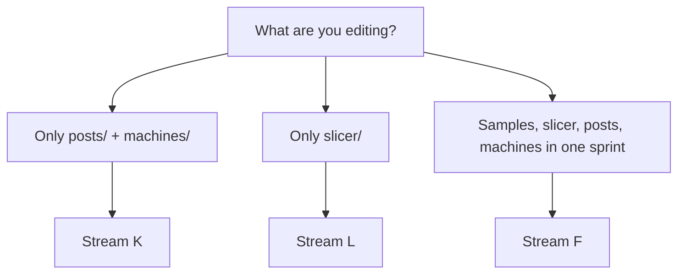

# Agent brief — Stream F: Resources only (`resources/`)

## Parity queue

**This stream’s done vs next:** [`ALL_STREAMS_AGENT_PLANS.md`](ALL_STREAMS_AGENT_PLANS.md) — *Stream status & todos* → row **F** (`resources/**` bundles). Canonical phases: [`PARITY_PHASES.md`](../PARITY_PHASES.md).

**Role:** Ship **bundled data** the app loads at runtime or that humans copy as samples — **without** touching application TypeScript except a **single-line** path fix when something is objectively broken.

## Quick reference (ALL_STREAMS Stream F block)

The compact pasteable charter lives in **[`ALL_STREAMS_AGENT_PLANS.md`](ALL_STREAMS_AGENT_PLANS.md)** under **Stream F — Resources only** (same app root, scope, gates, and `Shipped:` line as below).

### Scope (allowed vs forbidden)

| Allowed | Forbidden (unless exception) |
|---------|------------------------------|
| All of `unified-fab-studio/resources/**` — machines JSON, posts (`.hbs`), slicer stubs, `sample-*` | `src/**` except **one** objective one-line path/string fix |
| Optional `docs/**/*.md` that **describe** resource paths | IPC, preload, schemas, `fusion-style-command-catalog.ts`, `engines/*` |

### When to use F vs K vs L

- **Stream K** — `resources/posts/` + `resources/machines/` only ([`STREAM-K-posts-machines.md`](STREAM-K-posts-machines.md)).
- **Stream L** — `resources/slicer/` only ([`STREAM-L-cura-slicer.md`](STREAM-L-cura-slicer.md)).
- **Stream F** — work **spans** resource folders or you want the whole-`resources/` mandate in one chat.

### Gates and Aggressive F

- **`npm test`** is **not required** for changes **only** under `resources/` when **`docs/`** makes no IPC or test-covered path claims — see **Verification** below.
- If **`docs/`** asserts IPC channels, preload APIs, or source paths covered by tests, run **`npm test`** from `unified-fab-studio/`.
- For a merge-ready single slice, paste **Aggressive — Stream F** in [`PARALLEL_PASTABLES.md`](PARALLEL_PASTABLES.md).

### Safety

G-code and slicer output stay **unverified** for real machines — align tone with [`docs/MACHINES.md`](../MACHINES.md). Prefer additive files; grep before renaming machine `id`s or template names referenced elsewhere.

## Mission

Improve **`unified-fab-studio/resources/`** so machinists and developers get:

- **Machine profiles** (`resources/machines/*.json`) — realistic envelopes, `postTemplate` wiring, safety-oriented `meta` copy (see [`../MACHINES.md`](../MACHINES.md)).
- **Post templates** (`resources/posts/*.hbs`) — header comments that state **unverified output**, units, WCS, and dry-run expectations (match tone of existing `cnc_generic_mm.hbs`).
- **Sample projects** (`resources/sample-*/`) — coherent `project.json` + README explaining what each sample exercises and how it links to `docs/VERIFICATION.md` checklists where relevant.
- **Slicer stubs** (`resources/slicer/`) — definition JSON + notes in `README.md` (inherits, paths, Windows examples).

Optional: short **`docs/*.md`** updates that **describe** new or renamed resource paths (keep in sync with [`resources/README.md`](../../resources/README.md)).

## Hard rules

| Allowed | Forbidden |
|---------|-----------|
| All paths under `resources/**` | `src/**` changes except **one** objective path-string fix |
| `docs/**/*.md` that document resources | `fusion-style-command-catalog.ts`, schemas, IPC |
| JSON / Handlebars / Markdown only | New `ipcMain.handle` or preload API |

- **G-code and slicer output** are never guaranteed safe — never imply otherwise in comments; point readers to **`docs/MACHINES.md`**.
- Prefer **additive** files (new machine stub, new sample folder) over renaming IDs that production JSON might reference; if you rename an `id`, grep the repo for the old value first.

## Directory map (inventory)

See **[`resources/README.md`](../../resources/README.md)** for the canonical tree. At a glance:

| Folder | Contents |
|--------|----------|
| `machines/` | CNC / printer machine JSON consumed by CAM and posts — **[`resources/machines/README.md`](../../resources/machines/README.md)** lists bundled `id`s |
| `posts/` | Handlebars post templates — **[`resources/posts/README.md`](../../resources/posts/README.md)** lists templates and template context |
| `slicer/` | CuraEngine definition stubs + README |
| `sample-*` | On-disk project samples (kernel, assembly, manufacture) |

## Overlap with other streams

- **Stream K** — *only* `resources/posts/` + `resources/machines/`. Full brief: **[`STREAM-K-posts-machines.md`](STREAM-K-posts-machines.md)**. Use **K** for a focused post/machine sprint; use **F** when you also touch samples or slicer.
- **Stream L** — *only* `resources/slicer/` + slicer-related docs. Full brief: **[`STREAM-L-cura-slicer.md`](STREAM-L-cura-slicer.md)**; merge-ready: **Aggressive — Stream L** in [`PARALLEL_PASTABLES.md`](PARALLEL_PASTABLES.md). Use **L** for Cura-only work; use **F** for cross-folder resource work.

## Verification

- **No `npm test` required** if you change **only** files under `resources/` (JSON, hbs, md inside resources).
- Run **`npm test`** from `unified-fab-studio/` if you edit **`docs/`** and those edits reference **IPC channels, source paths, or filenames** covered by tests (same bar as Stream G).

## Success criteria (pick one slice per chat)

- One **shipped artifact**: e.g. new machine stub + README line, expanded post header comments, new sample README, or slicer stub notes — with **honest** safety language.

## Final reply format

End with a single line:

`Shipped: F — Resources — <path> — <artifact>.`

