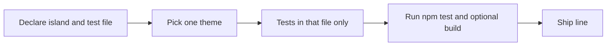

# Agent brief — Stream H: Tests only (Vitest)

## Parity queue

**This stream’s done vs next:** [`ALL_STREAMS_AGENT_PLANS.md`](ALL_STREAMS_AGENT_PLANS.md) — *Stream status & todos* → row **H** (Vitest islands H1–H4). Canonical phases: [`PARITY_PHASES.md`](../PARITY_PHASES.md).

**Role:** Increase **confidence and regression coverage** with **Vitest** — **without** owning product features, IPC batches, or large production refactors.

## Mission

Ship **tests** so that:

- **Behavior stays pinned** — edge cases, parse errors, math helpers, and schema round-trips that are easy to break in parallel work.
- **Parallel agents stay safe** — you work in **one island** (below) per chat so you rarely conflict with Stream **A–E** on the same production files.
- **Merge friction stays low** — prefer extending an existing `*.test.ts` over new hot-file churn; production diffs are **tiny** (e.g. export a pure helper) or **zero**.

## First message (pasteable-ready)

Open each Stream H chat with:

1. **Island:** **H1** | **H2** | **H3** | **H4** (exactly one).
2. **Target file:** **one** `*.test.ts` for this chat (prefer an existing file in that island; avoid two agents editing the same test file in parallel).
3. **Theme:** one sentence on the behavior you will pin (e.g. schema rejection, path normalization, solver edge case).
4. **Paste:** **Stream H** or **Aggressive — Stream H** from [`PARALLEL_PASTABLES.md`](PARALLEL_PASTABLES.md) (aggressive adds **`npm run build`** to the gate).

## Allowed paths

| Primary | Notes |
|---------|--------|
| `src/**/*.test.ts` | Co-located or existing test files only |
| New `*.test.ts` next to the module under test | Same folder as the **single** island you chose |

**Touch `src/main/ipc-contract.test.ts` only when** the channels under test already exist in **`src/main/index.ts`** + **`src/preload/index.ts`** (added by **Stream S** or merged). Do not invent new `invoke` names here without S.

## Hard rules

| Allowed | Forbidden |
|---------|-----------|
| New `describe` / `it` blocks, fixtures, snapshots **in test files** | New **`ipcMain.handle`** / preload API (**Stream S**) |
| **One-line** `export` on a pure function if tests need it | Edits to **`src/main/index.ts`** for anything except re-exports you were explicitly asked to add (default: **forbidden**) |
| Refactor **test helpers** inside `*.test.ts` | **`fusion-style-command-catalog.ts`** status rows (**feature streams** or **G** for docs about catalog) |
| Mock filesystem / `vi.mock` in main-process tests where patterns already exist | Drive-by **production** “cleanup” unrelated to making an assertion possible |

- **Hot production files** (`App.tsx`, `design-schema.ts`, `sketch-profile.ts`): do not edit in **H** unless another stream owns the same merge batch and you have a **≤5 line** export/type fix — prefer testing through public APIs in cooler files.
- **`npm test`** from **`unified-fab-studio/`** must pass before you claim done.
- For **Aggressive — Stream H**, also run **`npm run build`** (same bar as other aggressive streams).

## Islands (pick **one** per chat)

Use this table to **declare ownership** in your first message. Stay inside the island’s folders for **production** imports you touch; **test** files should live next to code in that island.

| Island | Production tree (read / minimal export only) | Example existing tests |
|--------|-----------------------------------------------|-------------------------|
| **H1 — Shared schemas & catalog** | `src/shared/*.ts` (avoid simultaneous edits to `design-schema.ts` / `sketch-profile.ts` with **Stream A**) | `design-schema.test.ts`, `manufacture-schema.test.ts`, `kernel-manifest-schema.test.ts` |
| **H2 — Main helpers (not IPC registration)** | `src/main/**/*.ts` **except** `src/main/index.ts` | `cam-local.test.ts`, `post-process.test.ts`, `mesh-import-registry.test.ts` |
| **H3 — Design renderer / sketch math** | `src/renderer/design/*.ts` | `solver2d.test.ts`, `sketch-mesh.test.ts`, `viewport3d-bounds.test.ts` |
| **H4 — IPC contract (tight)** | Preload + main **read-only** verification | `ipc-contract.test.ts` — **only** when channels are already wired |

**H4** is the narrowest lane: extend assertions for **existing** channels; if a test needs a **new** channel, stop and hand off **Stream S**.

**Merge safety:** Prefer **one active chat per `*.test.ts`** so parallel agents do not conflict. Extending **one** existing test file beats adding many small files that all import the same hot module.

## Overlap with other streams

| Stream | Relationship |
|--------|----------------|
| **A** | A owns sketch schema/UI; **H1/H3** tests may import those modules — avoid editing the same **production** file in the same batch. |
| **S** | S owns `main/index.ts` + `preload`; **H** does not register handlers. |
| **T** | T may fix **≤3** tiny test/assertion items; **H** owns deliberate coverage expansion. |
| **G** | G fixes docs that **cite** test paths; **H** adds tests — if a doc promises a suite, **G** can align prose after **H** lands. |
| **O** | **O** ships production changes in `src/shared/**` (not sketch); **H1** may extend tests for the same module — **serialize** on the same file + `*.test.ts` in one batch. |
| **N** | **N** owns **`Viewport3D.tsx`** and may edit **`viewport3d-bounds.ts`**; **H3** extends **`viewport3d-bounds.test.ts`**. Avoid the same batch on **`viewport3d-bounds.ts`** without declaring ownership — prefer **N** for production + **H** for tests in sequence. |
| **P** | **P** edits **production** `src/main/*.ts` (not `index.ts`); **H2** extends **`src/main/*.test.ts`**. Serialize on the same file pair or split ownership per batch. |
| **R** | **R** owns mesh import, tool libraries, registry wiring; **H** may **import** that behavior in tests but must not expand **feature** scope (new IPC, routing) under **H**. |
| **B** | **B** owns kernel build / CadQuery bridges from the TS side; **H** tests via public helpers/schemas — avoid same-batch production edits on **`build-kernel-part.ts`** without coordination. |
| **D** | **D** owns manufacture-facing **`tool-schema`** and related contracts; **H** adds tests only; coordinate if assertions require schema changes. |

### Serialization before production edits

If you need a **non-test** change (e.g. one-line `export`):

1. Check the table above for **S / P / O / A / N / R / B / D** on the same **production** path in this batch.
2. **Serialize** (finish the other stream’s merge first) or **declare shared ownership** in the chat — do not silently edit the same module another stream owns.

## Success criteria (pick one slice per chat)

- **One shipped theme**: e.g. “manufacture schema rejects bad op id”, “cam-local path normalization”, “solver2d constraint edge case”, or “ipc-contract documents existing channel list”.
- **`npm test` green**; for aggressive pasteables, **`npm run build`** green too.
- **Before merge / release batches:** run **`npm run build`** even when not using the aggressive pasteable (same bar as other pre-merge hygiene).

## Workflow per chat



1. Declare island + **single** target `*.test.ts` (see [First message](#first-message-pasteable-ready)).
2. Add `describe` / `it`, fixtures, or snapshots **in that file**; use `vi.mock` only where existing main-process tests already do.
3. Run **`npm test`** from **`unified-fab-studio/`**; add **`npm run build`** for **Aggressive — Stream H** or pre-merge.
4. End with a ship line (below).

## Backlog over time

Treat “more coverage” as **many small Stream H chats**, not one large batch:

1. Use [`../VERIFICATION.md`](../VERIFICATION.md) § *Automated baseline* and feature sections to pick **high-regression** themes (IPC subset, CAM, assembly, drawing export, slicer, sketch/kernel payloads).
2. Each chat: **one island**, **one test file**, **one theme**.
3. After **Stream S** lands new handlers, schedule **H4** to extend **`ipc-contract.test.ts`** for channels already wired.
4. If docs promise a suite path, **Stream G** can align prose after **H** lands — **H** does not rewrite docs for this.

**Inventory:** there are many existing `src/**/*.test.ts` files — extend them before adding new files when practical.

## Out of scope

- Utilities UI (**Stream Q**), **`resources/`** bundles (**Stream F / K / L**), Python engines (**Stream I / J**), full verifier reports (**Stream M**), doc-only edits (**Stream G**).

## Final reply format

End with a single line:

`Shipped: Tests — <island + file(s)> — <behavior now guarded>.`

Alternate (one-line plans menu): `Shipped: H — <island> — <test file> — <coverage added>.` — pick one format per team and stay consistent.

---

## Focused Vitest runs

From **`unified-fab-studio/`** (optional speed loop while editing one island):

```bash
npx vitest run src/shared/manufacture-schema.test.ts
npx vitest run src/main/cam-local.test.ts
npx vitest run src/renderer/design/solver2d.test.ts
npx vitest run src/main/ipc-contract.test.ts
```

Use **`npx vitest run --watch`** on a single file only if you are not relying on full-suite ordering side effects (there should be none — prefer explicit setup per file).

## See also

- One-line paste block: [`ALL_STREAMS_AGENT_PLANS.md`](ALL_STREAMS_AGENT_PLANS.md) § Stream H — Tests only.
- Pasteables menu: [`PARALLEL_PASTABLES.md`](PARALLEL_PASTABLES.md) — **Stream H**, **Aggressive — Stream H**, **MICRO-SPRINT (Stream H)**. Main-process production work in the same folders → **Stream P** ([`STREAM-P-electron-main-helpers.md`](STREAM-P-electron-main-helpers.md)).
- Manual checklists and suite pointers: [`../VERIFICATION.md`](../VERIFICATION.md).
- IPC channel ground truth: [`../../src/main/ipc-contract.test.ts`](../../src/main/ipc-contract.test.ts) (and **`src/preload/index.ts`** + **`src/main/index.ts`** for **H4**).
